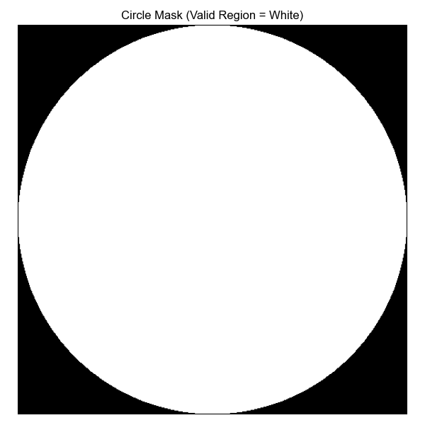
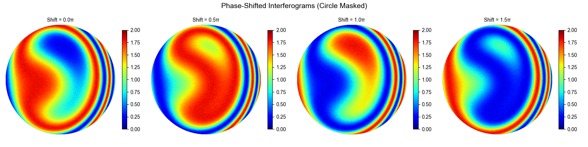
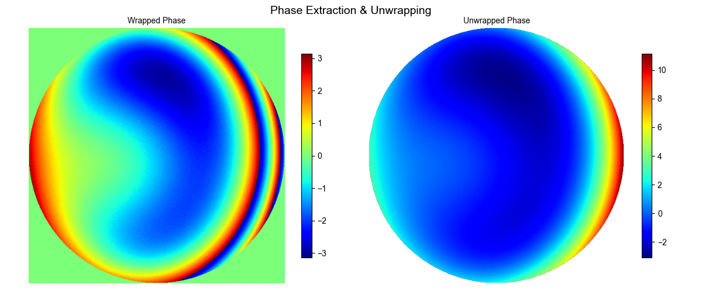
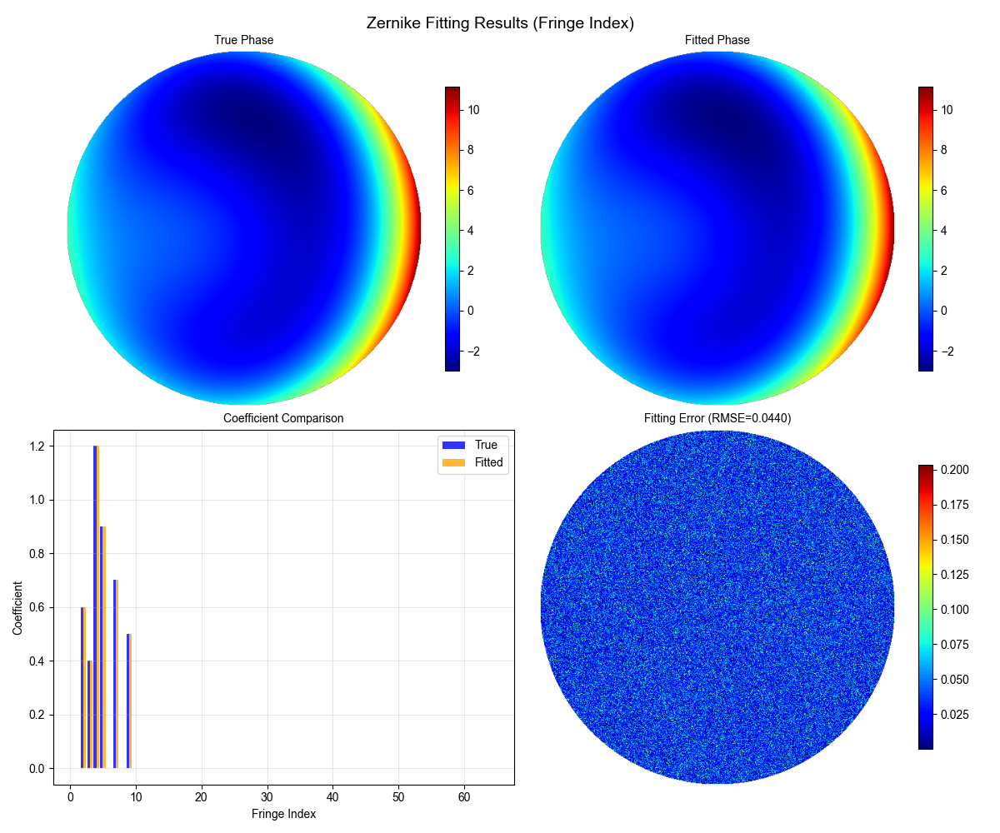

# PSI Algorithm：基于Fringe索引的Zernike拟合全流程


基于 **Fringe索引规则** 的Zernike多项式实现光学干涉测量全流程：干涉图仿真 → 相位提取 → 相位解包裹 → Zernike多项式拟合，适用于光学干涉算法验证、Zernike多项式学习与研究。

## 📖 项目介绍

本项目围绕**Fringe索引**（区别于传统ANSI Zernike索引）的Zernike多项式展开，实现了从干涉图仿真到Zernike拟合的端到端流程：

1. 统一网格/极坐标/圆形掩码生成，避免多模块极径处理不一致问题；

2. 自动生成Fringe索引的Zernike多项式（含正交归一化），支持表达式打印、可视化；

3. 仿真带噪声的多步相移干涉图（支持4步相移）；

4. 基于相移算法提取包裹相位，通过区域增长法解包裹；

5. 最小二乘拟合Zernike系数，量化对比真实/拟合相位与系数；

6. 全流程可视化，直观展示每一步结果。

## ✨ 核心特性

- **鲁棒的网格处理**：封装`GridGenerator`类，统一管理笛卡尔/极坐标网格、单位圆掩码，避免手动修改极径导致的逻辑错误；

- **标准Zernike实现**：严格遵循Fringe索引规则，支持Zernike多项式表达式自动生成、正交归一化；

- **高保真仿真**：支持添加高斯噪声、调制深度配置，模拟真实干涉图特性；

- **完整流程验证**：从干涉图仿真到拟合结果量化，全流程自验证，便于算法调试；

- **友好的可视化**：提供干涉图、包裹/解包裹相位、真实/拟合相位、系数对比等多维度可视化。

## 🛠️ 环境配置

### 依赖库

```Plain Text

numpy >= 1.21.0
scipy >= 1.7.0
matplotlib >= 3.4.0
```

### 安装方式

```Bash

# 克隆仓库
git clone https://github.com/seatonyang/PSI-Algorithm.git
cd PSI-Algorithm

# 安装依赖
pip install -r requirements.txt
# 或手动安装
pip install numpy scipy matplotlib
```

## 🚀 快速开始

### 运行完整流程

```Bash

# 运行主程序（含仿真→提取→解包裹→拟合→可视化）
python main.py
```

### 核心功能示例

#### 1. 生成统一网格

```Python

from grid_utils import GridGenerator

# 生成512×512网格（-1~1笛卡尔坐标，0~√2极径）
grid = GridGenerator(size=512)
print(f"网格尺寸：{grid.size}×{grid.size}")
print(f"单位圆有效像素数：{np.sum(grid.circle_mask)}")
```

#### 2. 生成Fringe Zernike多项式

```Python

from fringe_zernike_generator import FringeZernike

# 初始化Zernike生成器（8阶，基于统一网格）
zernike_gen = FringeZernike(max_order=8, grid=grid)

# 生成第4阶（Focus）多项式
z4 = zernike_gen.generate(4)
# 打印多项式表达式
zernike_gen.print_zernike_expression(index=4)
# 可视化单个多项式
zernike_gen.plot_single(index=4, cmap="jet")
```

#### 3. 仿真相移干涉图

```Python

from interferogram_simulation import InterferogramSimulator
import numpy as np

# 配置真实Zernike系数（8阶）
true_coeffs = np.zeros(8)
true_coeffs[1] = 0.6  # Tilt x
true_coeffs[3] = 1.2  # Focus
true_coeffs[4] = 0.9  # Astigmatism x

# 4步相移量
phase_shifts = [0, np.pi/2, np.pi, 3*np.pi/2]

# 初始化仿真器
simulator = InterferogramSimulator(
    grid=grid,
    max_order=8,
    true_coeffs=true_coeffs,
    phase_shifts=phase_shifts,
    noise_std=0.03  # 高斯噪声标准差
)

# 生成干涉图和真实相位
interferograms, true_phase = simulator.generate()
print(f"干涉图形状：{interferograms.shape}")  # (4, 512, 512)
```

#### 4. Zernike多项式拟合

```Python

from zernike_fitting import ZernikeFitter

# 初始化拟合器（基于解包裹相位）
fitter = ZernikeFitter(
    grid=grid,
    unwrapped_phase=unwrapped_phase,  # 解包裹后的相位
    max_order=8
)

# 最小二乘拟合
fitted_coeffs, fitted_phase = fitter.fit()

# 打印拟合结果
coeff_rmse = np.sqrt(np.mean((true_coeffs - fitted_coeffs)**2))
phase_rmse = np.sqrt(np.nanmean((true_phase - fitted_phase)**2))
print(f"系数拟合RMSE：{coeff_rmse:.6f}")
print(f"相位拟合RMSE：{phase_rmse:.6f}")
```

## 📂 代码结构

|文件|核心功能|
|---|---|
|`grid_utils.py`|统一网格生成工具：笛卡尔/极坐标网格、单位圆掩码、相位标准化|
|`fringe_zernike_generator.py`|Fringe Zernike多项式生成：索引映射、径向/角向多项式、可视化、表达式打印|
|`interferogram_simulation.py`|相移干涉图仿真：基于Zernike相位生成带噪声的干涉图|
|`phase_extraction.py`|相位提取：从相移干涉图中提取包裹相位|
|`phase_unwrapping.py`|相位解包裹：区域增长法解包裹，恢复连续相位|
|`zernike_fitting.py`|Zernike拟合：最小二乘拟合Zernike系数，生成拟合相位|
|`main.py`|主程序：串联全流程（仿真→提取→解包裹→拟合→可视化）|
|`requirements.txt`|依赖库清单|
## 📊 结果展示

### 1. 单位圆掩码



### 2. 4步相移干涉图



### 3. 包裹/解包裹相位



### 4. Zernike拟合结果




## 🎯 核心原理

### 1. Fringe Zernike索引规则

Fringe索引按`s = m + k`分组（`m`为角向阶数，`k`为径向子阶数），每组内按`m`递减排列，`m=0`时为纯径向项，`m≠0`时分为`cos(mθ)`（x向）和`sin(mθ)`（y向）项。

### 2. Zernike多项式定义

 $Z_n^m(r,θ) = R_n^m(r) × \begin{cases} 1 & (m=0) \\ \cos(mθ) & (m>0, \text{cos项}) \\ \sin(mθ) & (m>0, \text{sin项}) \end{cases} $ 

其中径向多项式 $R_n^m(r)$ 满足：

 $R_n^m(r) = \sum_{s=0}^{(n-m)/2} \frac{(-1)^s (n-s)!}{s! \left(\frac{n+m}{2}-s\right)! \left(\frac{n-m}{2}-s\right)!} r^{n-2s} $ 

### 3. 相移干涉术原理

4步相移干涉图的光强分布：

 $I_i = I_0 \left[1 + \gamma \cos(\phi + \delta_i)\right] $ 

其中 $\phi$ 为待测相位， $\delta_i$ 为相移量，通过4步相移算法提取相位：

 $\phi = \arctan\left(\frac{I_4 - I_2}{I_1 - I_3}\right) $ 

### 4. 最小二乘拟合

将解包裹相位分解为Zernike基的线性组合：

 $\phi(r,θ) = \sum_{i=1}^N c_i Z_i(r,θ) $ 

通过最小二乘求解系数 $c_i$ ：

 $\hat{c} = \arg\min_c \| \phi - AZ \|_2^2 $ 

其中 $A$ 为Zernike基底矩阵， $Z$ 为Zernike多项式向量。

## 📄 许可证

本项目采用MIT许可证 - 详见[LICENSE](LICENSE)文件。

## 🙏 致谢

- 感谢光学干涉测量领域的经典文献与开源项目启发；

- 感谢`numpy`、`scipy`、`matplotlib`等开源库提供的基础支持。

## 📞 联系作者

- GitHub: [seaton.yang](https://github.com/seatonyang)

- Email: [seaton.yang@foxmail.com](seaton.yang@foxmail.com)

---
